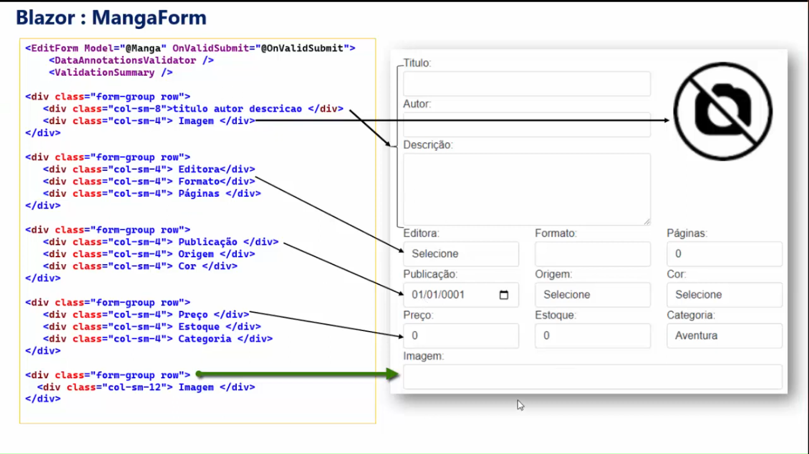

# GeekHub

## Sobre o Projeto 
- O GeekHub faz parte de um conjunto de três projetos, desenvolvidos para a avaliação final da 5ª Academia de .NET. O projeto Final consiste de três aplicações (Front-End, Back-End e IA, para fazer conexão com ChatGPT e Gerador de imagens) que trabalham em conjunto, neste repositório encontra-se a parte do Front-End do Projeto, feita com Blazor WebAssembly.

- Neste projeto, você pode cadastrar, remover e editar novos mangás e/ou HQs, que apresenta dados como título, autor, descrição, editora, publicação, formato, número de páginas, data de publicação, origem, cor, preço, estoque, categoria e imagem.  
  

- Você também pode catalogar mangás e/ou HQs, pelas suas categorias.  

 

- Se você é um amante da cultura Geek e deseja catalogar/gerenciar suas próprias HQs/mangás em nosso GeekHub, basta criar uma conta utilizando seu e-mail e senha para acessar a área de cadastrar e catalogar mangás e/ou HQs. 

## Vídeo Apresentação do Projeto
- [Apresentação do Projeto]()

## Links para os outros projetos
[Back-End (API)](https://github.com/IsaquePemasi/GeekHubApi)
 
[IAs](https://github.com/IsaquePemasi/GeekHubIA)

## Ferramentas e padrões de desenvolvimento utilizados
- C#
- HTML5
- CSS3
- jQuery
- Bootstrap
- Blazor
- Blazor WebAssembly
- Microsoft ASP.NET
- FormSubmit
- Versionamento de Código com Git e Github
- Integração com o Back-End
- Consumo de API
- Consumo de IAs

<h2 align="center">Autor</h2>
